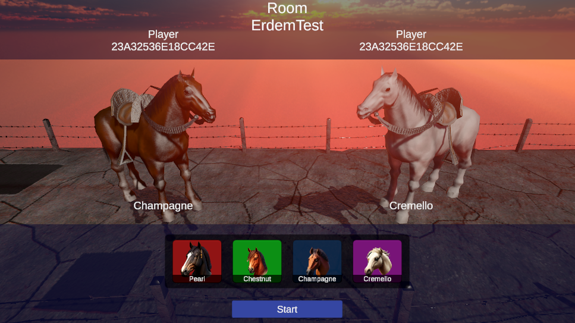

# Horse Race

## Table of Contents
- [Summary](#summary)
- [Overview](#overview)
- [Game Mechanics](#gamemechanics)
- [Features](#features)
- [TechnologiesUsed](#technologiesused)
- [InstallationAndSetup](#installationandsetup)
- [HowToPlay](#howtoplay)
- [Conclusion](#conclusion)

## Summary
Horse Race is a multiplayer game that allows players to join a race with a pre-defined horse with different properties. The game supports two players in the multiplayer room, and the winner is selected based on the game mechanics, such as horse speed and boost amount. Players who win the game earn one point, and the leaderboard shows the top 10 winners. The game also includes a settings part where players can turn on/off the game voice.

## Overview
The game consists of two main scenes, the "Lobby" and the "Game" scene. The Lobby scene allows players to find or create a room, and it shows the leaderboard and settings. The Game scene has two parts, the "Before Game Start" and the "Game Part".

Before the Game starts, the master client waits for all other players to join the room. If the other player is not ready, the master client must wait. If all the players in the room are ready, the game begins. In the Game Part, the horses are spawned at a specific start point, and players can increase the speed of their horses by tapping/clicking to boost button. The first horse that reaches the finish line wins the game.

## Game Mechanics
The game's core mechanics are as follows:

- Tapping/clicking to boost button makes the horse run faster and allows it to reach the finish line before the opponent.
- The player who wins the game gets one point and is listed on the leaderboard.
- The game's winner is determined based on horse properties such as speed, and boost power.

## Features
The game includes the following features:

Cross-platform game.
Multiplayer support.
Leaderboard to show the top 10 winner users on the main menu.
Settings to turn on/off the game voice.
Two players simultaneously in the showing game scene in the multiplayer room.

## Technologies Used
The game was developed using the following technologies:

Unity (version 2021.3.2f1)
- C#
- Photon Pun 2
- PlayFab
- Zenject

## Installation and Setup
To install and run the game, follow these steps:

- Clone the repository or download the ZIP file.
- Open the project in Unity (version 2021.3.2f1).
- Build the project for the desired platform.
- Install the game on the device and run it.

## How to Play
To play the game, follow these steps:

Launch the game.
Click "Find Room" or "Create Room" in the Lobby scene.
Select a horse and click "Ready" in the Before Game Start part.
Click the boost button to make the horse run faster.
The settings menu allows the player to mute/unmute the game sound.

## Conclusion
Overall, this game provides an exciting and competitive multiplayer experience for players of all skill levels.